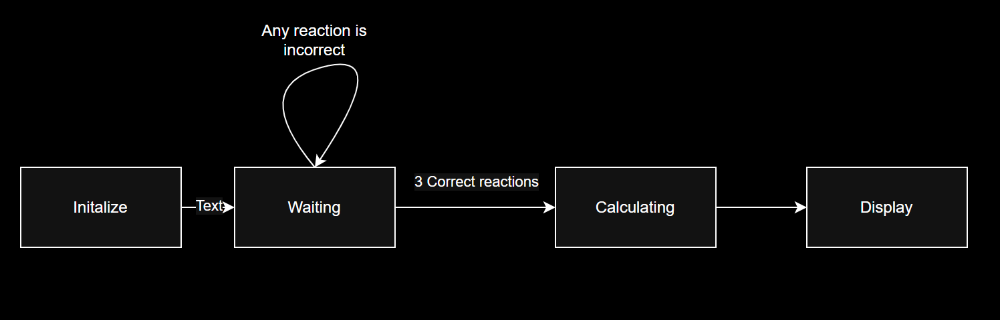

# Instructions
- From https://github.com/byett/dsd/blob/CPE487-Spring2025/projects/README.md
## Submission (80% of your project grade):
* Your final submission should be a github repository of very similar format to the labs themselves with an opening README document with the expected components as follows:
	* A description of the expected behavior of the project, attachments needed (speaker module, VGA connector, etc.), related images/diagrams, etc. (10 points of the Submission category)
		* The more detailed the better – you all know how much I love a good finite state machine and Boolean logic, so those could be some good ideas if appropriate for your system. If not, some kind of high level block diagram showing how different parts of your program connect together and/or showing how what you have created might fit into a more complete system could be appropriate instead.
	* A summary of the steps to get the project to work in Vivado and on the Nexys board (5 points of the Submission category)
 	* Description of inputs from and outputs to the Nexys board from the Vivado project (10 points of the Submission category)
  		* As part of this category, if using starter code of some kind (discussed below), you should add at least one input and at least one output appropriate to your project to demonstrate your understanding of modifying the ports of your various architectures and components in VHDL as well as the separate .xdc constraints file.
	* Images and/or videos of the project in action interspersed throughout to provide context (10 points of the Submission category)
	* “Modifications” (15 points of the Submission category)
		* If building on an existing lab or expansive starter code of some kind, describe your “modifications” – the changes made to that starter code to improve the code, create entirely new functionalities, etc. Unless you were starting from one of the labs, please share any starter code used as well, including crediting the creator(s) of any code used. It is perfectly ok to start with a lab or other code you find as a baseline, but you will be judged on your contributions on top of that pre-existing code!
		* If you truly created your code/project from scratch, summarize that process here in place of the above.
	* Conclude with a summary of the process itself – who was responsible for what components (preferably also shown by each person contributing to the github repository!), the timeline of work completed, any difficulties encountered and how they were solved, etc. (10 points of the Submission category)
* And of course, the code itself separated into appropriate .vhd and .xdc files. (50 points of the Submission category; based on the code working, code complexity, quantity/quality of modifications, etc.)
* You are not really expected to be github experts – as long as one of you can confidently create the repository and help others add to it, that should be sufficient. If no group members fall under this criteria, discuss with me as soon as possible.
	* This is a group assignment, and for the most part you are graded as a group. I reserve the right to modify single student grades for extenuating circumstances, such as a clear lack of participation from a group member. You are allowed to rely on the expertise of your group members in certain aspects of the project, but you should all have at least a cursory understanding of all aspects of your project.

## Presentation (20% of your project grade):
* Additionally, you’ll be expected to give a demonstration + presentation during the final exam period. This can take the form of a live demonstration + informal discussion (the encouraged option in most situations that will be given more leeway from any technical difficulties), or a pre-created video including the project in action + slides describing much of the same content as the github submission (a backup option primarily for groups that will be missing multiple members during the final exam period).
	* Though this a group assignment, the presentation in particular is an area where I will penalize students who do not participate in the presentation/discussion or who are unable to answer questions about their project.

## Extra Notes:

* If you need a single copy of any of the hardware (attachments) we use during the course, that should not be an issue. If you need multiple copies, there may be some “wait and see” situations and/or you may have minimal time to test the full implementation with all components.
* For more complex projects that would require hardware that you do not already readily have access to, it is sufficient to model the desired final system in some way. For example, showing the output of a controller for a microwave or other digital system on the LCD screen instead of actually controlling a microwave.
	* That said, if you already own these needed components, by all means use them!
* If you are still “attached” to a particular lab (calculator, pong, etc.), you may still explore these areas further with additional functionality (many more operations for a calculator, multiple players or other modifications for pong, etc.)
* You may also start with some of the components from the simulation exercices and approach the project from more of a true digital logic perspective using combinational and sequential logic techniques in a sufficiently advanced way.
* You may instead peruse the following list of projects (or outside project sources) for some ideas. Some of these were personally vetted by me (Prof. Yett), others came prior to my time at Stevens. 
* If you choose to start from an existing project and make substanstial changes/improvements, you must cite your starting place! This goes for the labs, these projects, or any others you may find. Do not pass off someone else's work as your own and you'll do just fine.
# Our Project
## Summary
For our project we decided to work on creating a reaction test that would challege the player to react to the display as fast as they can. From when the game begins four red blocks would appear on the display and at a random time one will turn green. Once the player successfully hit the three neccessary blocks the NexysA7 100T board will display the players average reaction time. In order to accomplish this we used base code from the [clock](https://github.com/cfoote5/CPE487_FinalProject) and [whack-a-mole](https://github.com/beartwoz/Whack-A-Mole) projects. These projects provided a good starting point for implementing a clock that would display milliseconds and developing the VGA display that the player would interact with.
## Expected Behavior

- The VGA screen will display a four blocks (positioned up, down, left, and right) and whichever block turns green the player must hit the corresponding button on the board.
- The goal is to test how fast the player can react.
- The game will play for three rounds.
- The average time over the three rounds is the players score.
- The players score will display on the board in milliseconds.
### [Demonstration](https://drive.google.com/file/d/1wT0SU7qmNwO605OzWVExHnS3_MaBIyPG/view?usp=sharing)
## Requirments
- Nexys A7 100T Board
- Micro-USB to USB Cable
- Computer with Vivado installed
- Monitor
- VGA Cable
## Program Setup
### 1. Create new RTL project React_test in Vivado Quick Start
- Create eight new source files of file type VHDL called ***clk_1kHz***, ***Clock_1Hz***, ***clk_wiz_0***, ***clk_wiz_0_clk_wiz***, ***leddec16***, ***squares***, ***vga_sync***, and ***vga_top_squares***.
- Create a new constraint file of file type XDC called ***allcons***.
- Choose Nexys A7-100T board for the project
- Click 'Finish'
- Click design sources and copy the VHDL code from the repo.
- Click contraints and copy the code from allcons.xdc
- As an alternative, you can instead download files from Github and import them into your project when creating the project. The source file or files would still be imported during the Source step, and the constraint file or files would still be imported during the Constraints step.

### 2. Run synthesis
### 3. Run implementation
### 4. Generate bitstream, open hardware manager, and program device.
- Click 'Generate Bitstream'
- Click 'Open Hardware Manager' and click "Open Target' then 'Auto Connect'
- Click 'Program Device' to download the program to the Nexys A7-100T board.
## Description of the modules
### ***clk_1kHz.vhd***
This module produces a 1 kHz clock output (clk2) from the system clock input. It uses a counter that toggles the output every 50,000 cycles. This clock pulses every millisecond and was used to for the 7-segment display.

### ***clk_wiz_0.vhd***
This module defines a clock management module that generates a stable system clock (clk_out1) from a primary input clock (clk_in1). This module ensures that all time-dependent components—such as the VGA synchronization (vga_sync), the 1 kHz and 1 Hz clock dividers, and display timing logic—receive a precise and reliable clock signal.

### ***clk_wiz_0_clk_wiz.vhd***
This module is an auto-generated clock management module from Vivado. This module is used to help ensure that the system operates with properly derived clock signals, helping reduce timing errors.

### ***clock_1Hz***
This module creates a 1 Hz clock pulse from a faster input clock. It uses a counter that toggles an internal signal every 50 million clock cycles, effectively dividing the clock to 1 Hz for the game timing controlling the rate at which the squares appear.

### ***leddec16.vhd***
This module implements a display decoder that shows 4-digit values on an 8-digit 7-segment display. It selects which digit to display using the dig input and extracts a 4-bit data point from the 16-bit data input to convert into segment outputs (seg). It also activates the corresponding anode for the selected digit.

### ***squares.vhd***
This module determines whether the current VGA pixel lies within a user-defined square. It uses input coordinates (x_pos, y_pos) as the top-left corner of the square and compares them with the current pixel column and row values. If the pixel lies within the square and the active signal is high, it outputs colored signals (red, green). This module forms the core of rendering geometric shapes on the screen.

### ***vga_sync.vhd***
This module generates the necessary VGA timing signals to produce a correct image on screen. It takes a pixel clock and RGB inputs and outputs hsync, vsync, pixel row and column positions (pixel_row, pixel_col), and routed RGB signals.

### ***vga_top_squares.vhd***
This module serves as the top level entity named vga_top. This module directs the entire VGA display system receiving input from directional buttons (btnl, btnr, btnu, btnd) and driving the VGA output signals (vga_red, vga_green, vga_blue, vga_hsync, vga_vsync). It integrates submodules for clocking, synchronization, square drawing, and LED display. Additionally, it outputs data to a 7-segment display through SEG7_anode for score.
