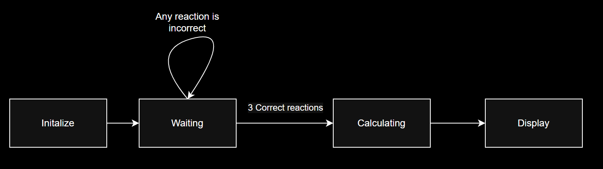

# Our Project
## Summary
For our project we decided to work on creating a reaction test that would challenge the player to react to the display as fast as they can. From when the game begins four red blocks would appear on the display and at a random time one will turn green. Once the player successfully hits the three necessary blocks the NexysA7 100T board will display the player's average reaction time. In order to accomplish this we used base code from the [clock](https://github.com/cfoote5/CPE487_FinalProject) and [whack-a-mole](https://github.com/beartwoz/Whack-A-Mole) projects. These projects provided a good starting point for implementing a clock that would display milliseconds and developing the VGA display that the player would interact with.
## Expected Behavior

- The VGA screen will display four blocks (positioned up, down, left, and right) and whichever block turns green the player must hit the corresponding button on the board.
- The goal is to test how fast the player can react.
- The game will play for three rounds.
- The average time over the three rounds is the player's score.
- The player's score will display on the board in milliseconds.
### [Demonstration](https://drive.google.com/file/d/1wT0SU7qmNwO605OzWVExHnS3_MaBIyPG/view?usp=sharing)
## Requirements
- Nexys A7 100T Board
- Micro-USB to USB Cable
- Computer with Vivado installed
- Monitor
- VGA Cable
## Program Setup
### 1. Create new RTL project React_test in Vivado Quick Start
- Create eight new source files of file type VHDL called ***clk_1kHz***, ***Clock_1Hz***, ***clk_wiz_0***, ***clk_wiz_0_clk_wiz***, ***leddec16***, ***squares***, ***vga_sync***, and ***vga_top_squares***.
- Create a new constraint file of file type XDC called ***allcons***.
- Choose Nexys A7-100T board for the project
- Click 'Finish'
- Click design sources and copy the VHDL code from the repo.
- Click constraints and copy the code from allcons.xdc
- As an alternative, you can instead download files from Github and import them into your project when creating the project. The source file or files would still be imported during the Source step, and the constraint file or files would still be imported during the Constraints step.
### 2. Run synthesis
### 3. Run implementation
### 4. Generate bitstream, open hardware manager, and program device.
- Click 'Generate Bitstream'
- Click 'Open Hardware Manager' and click "Open Target' then 'Auto Connect'
- Click 'Program Device' to download the program to the Nexys A7-100T board.
## Description of the modules
### ***clk_1kHz.vhd***
This module produces a 1 kHz clock output (clk2) from the system clock input. It uses a counter that toggles the output every 50,000 cycles. This clock pulses every millisecond and was used for the 7-segment display.
- Input: plk_clk (from clk_wiz_0)
- Output: clk_1khz_out
- Code from [clk_1kHz.vhd](https://github.com/cfoote5/CPE487_FinalProject/blob/92252b9b1d2d3259ba6e6eb15850c78f039931d4/clk_1kHz.vhd) in [clock](https://github.com/cfoote5/CPE487_FinalProject)
### ***clk_wiz_0.vhd***
This module defines a clock management module that generates a stable system clock (clk_out1) from a primary input clock (clk_in1). This module ensures that all time-dependent components—such as the VGA synchronization (vga_sync), the 1 kHz and 1 Hz clock dividers, and display timing logic—receive a precise and reliable clock signal.
- Input: clk_in (from board)
- Output: plk_clk
- Code from [clk_wiz_0.vhd](https://github.com/beartwoz/Whack-A-Mole/blob/c3509649d219f83ef390502cbf7bf8d1a7126aee/clk_wiz_0.vhd) in [whack-a-mole](https://github.com/beartwoz/Whack-A-Mole)
### ***clk_wiz_0_clk_wiz.vhd***
This module is an auto-generated clock management module from Vivado. This module is used to help ensure that the system operates with properly derived clock signals, helping reduce timing errors.
- Input: clk_in1
- Output: clk_out1
- Code from [clk_wiz_0_clk_wiz.vhd](https://github.com/beartwoz/Whack-A-Mole/blob/c3509649d219f83ef390502cbf7bf8d1a7126aee/clk_wiz_0_clk_wiz.vhd) in [whack-a-mole](https://github.com/beartwoz/Whack-A-Mole)
### ***clock_1Hz***
This module creates a 1 Hz clock pulse from a faster input clock. It uses a counter that toggles an internal signal every 50 million clock cycles, effectively dividing the clock to 1 Hz for the game timing controlling the rate at which the squares appear.
- Input: pxl_clk (from clk_wiz_0)
- Output: clk_1hz_out
- Code from [clk_1Hz.vhd](https://github.com/cfoote5/CPE487_FinalProject/blob/92252b9b1d2d3259ba6e6eb15850c78f039931d4/clock_1Hz.vhd) in [clock](https://github.com/cfoote5/CPE487_FinalProject)
### ***leddec16.vhd***
This module implements a display decoder that shows 4-digit values on an 8-digit 7-segment display. It selects which digit to display using the dig input and extracts a 4-bit data point from the 16-bit data input to convert into segment outputs (seg). It also activates the corresponding anode for the selected digit.
- Input: led_mpx (used to choose the digits), seg7_data (data to display)
- Output: SEG7_anode (anodes on the display), SEG7_seg (segments to turn on based on the digits)
#### Modification
We added the code below to convert our binary data input to decimal and modified the code to display it on the 7-segment display.
```
SIGNAL decimal_value : STD_LOGIC_VECTOR (15 DOWNTO 0);
BEGIN
    -- change binary to decimal
	PROCESS(data)
		VARIABLE temp : STD_LOGIC_VECTOR(15 DOWNTO 0);
		VARIABLE decimal : UNSIGNED(15 DOWNTO 0) := (OTHERS => '0');
		VARIABLE binary : UNSIGNED(15 DOWNTO 0);
	BEGIN
		binary := unsigned(data);
		decimal := (OTHERS => '0');
		
		for i in 0 to 15 loop
			if decimal(3 downto 0) > 4 then 
				decimal(3 downto 0) := decimal(3 downto 0) + 3;
			end if;
			if decimal(7 downto 4) > 4 then 
				decimal(7 downto 4) := decimal(7 downto 4) + 3;
			end if;
			if decimal(11 downto 8) > 4 then 
				decimal(11 downto 8) := decimal(11 downto 8) + 3;
			end if;
			
			-- Shift left
			decimal := decimal(14 downto 0) & binary(15);
			binary := binary(14 downto 0) & '0';
		end loop;
		
		decimal_value <= std_logic_vector(decimal);
	END PROCESS;
	data4 <= decimal_value(3 DOWNTO 0) WHEN dig = "000" ELSE -- digit 0
		         decimal_value(7 DOWNTO 4) WHEN dig = "001" ELSE -- digit 1
		         decimal_value(11 DOWNTO 8) WHEN dig = "010" ELSE -- digit 2
		         decimal_value(15 DOWNTO 12); -- digit 3
		-- Turn on segments corresponding to 4-bit data word
		seg <= "0000001" WHEN data4 = "0000" ELSE -- 0
		       "1001111" WHEN data4 = "0001" ELSE -- 1
		       "0010010" WHEN data4 = "0010" ELSE -- 2
		       "0000110" WHEN data4 = "0011" ELSE -- 3
		       "1001100" WHEN data4 = "0100" ELSE -- 4
		       "0100100" WHEN data4 = "0101" ELSE -- 5
		       "0100000" WHEN data4 = "0110" ELSE -- 6
		       "0001111" WHEN data4 = "0111" ELSE -- 7
		       "0000000" WHEN data4 = "1000" ELSE -- 8
		       "0000100" WHEN data4 = "1001" ELSE -- 9
		       "1111111";
```
- Base code from [leddec16.vhd](https://github.com/beartwoz/Whack-A-Mole/blob/c3509649d219f83ef390502cbf7bf8d1a7126aee/leddec16.vhd) in [whack-a-mole](https://github.com/beartwoz/Whack-A-Mole)
### ***squares.vhd***
This module determines whether the current VGA pixel lies within a user-defined square. It uses input coordinates (x_pos, y_pos) as the top-left corner of the square and compares them with the current pixel column and row values. If the pixel lies within the square and the active signal is high, it outputs colored signals (red, green). This module forms the core of rendering geometric shapes on the screen.
- Input: S_pixel_row, S_pixel_col (both from vga_sync), active_holes(i), hole_positions(i)(0) (x_pos), hole_positions(i)(1) (y_pos) (the rest from vga_top_squares)
- Output: S_red(i), S_green(i), S_blue(i)
#### Modification
We changed the size of the squares and their colors
```
ARCHITECTURE Behavioral OF square IS
    CONSTANT hole_width  : INTEGER := 100; -- Width of each square
    CONSTANT hole_height : INTEGER := 100; -- Height of each square
...
            IF active = '1' THEN
                red <= '0'; -- Hole is active (green)
                green <= '1';
                blue <= '0';
            ELSE
                red <= '1'; -- Hole is inactive (red)
                green <= '0';
                blue <= '0';
            END IF;
        ELSE
            red <= '0'; -- Outside the hole area (black)
            green <= '0'; 
            blue <= '0';
```
- Base code from [ball_moles.vhd](https://github.com/beartwoz/Whack-A-Mole/blob/c3509649d219f83ef390502cbf7bf8d1a7126aee/ball_moles.vhd) in [whack-a-mole](https://github.com/beartwoz/Whack-A-Mole)
### ***vga_sync.vhd***
This module generates the necessary VGA timing signals to produce a correct image on screen. It takes a pixel clock and RGB inputs and outputs hsync, vsync, pixel row and column positions (pixel_row, pixel_col), and routed RGB signals.
- Code from [vga_sync.vhd](https://github.com/beartwoz/Whack-A-Mole/blob/c3509649d219f83ef390502cbf7bf8d1a7126aee/vga_sync.vhd) in [whack-a-mole](https://github.com/beartwoz/Whack-A-Mole)
### ***vga_top_squares.vhd***
This module serves as the top level entity named vga_top. This module directs the entire VGA display system receiving input from directional buttons (btnl, btnr, btnu, btnd) and driving the VGA output signals (vga_red, vga_green, vga_blue, vga_hsync, vga_vsync). It integrates submodules for clocking, synchronization, square drawing, and LED display. Additionally, it outputs data to a 7-segment display through SEG7_anode for score.
#### Modifications 
1. Added btnl, btnr, btnu, and btnd and removed KB_col and KB_row because we will only use the buttons on the board not the keyboard
```
ENTITY vga_top IS
    PORT (
        clk_in    : IN STD_LOGIC;
        vga_red   : OUT STD_LOGIC_VECTOR (2 DOWNTO 0);
        vga_green : OUT STD_LOGIC_VECTOR (2 DOWNTO 0);
        vga_blue  : OUT STD_LOGIC_VECTOR (1 DOWNTO 0);
        vga_hsync : OUT STD_LOGIC;
        vga_vsync : OUT STD_LOGIC;
        --
        btnl : IN STD_LOGIC;
        btnr : IN STD_LOGIC;
        btnu : IN STD_LOGIC;
        btnd : IN STD_LOGIC;
        --
        SEG7_anode : OUT STD_LOGIC_VECTOR (7 DOWNTO 0); -- 7-segment anode outputs
        SEG7_seg   : OUT STD_LOGIC_VECTOR (0 TO 6)  -- 7-segment segment outputs
    );
END vga_top;
```
2. Added some signals for measuring the reaction time and managing the clocks.
3. Modified some signals so they match our project.  (e.g. position array (0 to 3) instead of 0 to 15)
4. Added our game states
5. Removed of the some signals we will not be using in our project
```
-- Mole Signals
    SIGNAL active_holes : STD_LOGIC_VECTOR(3 DOWNTO 0) := (OTHERS => '0'); -- Active mole holes
    
    -- Clock Signals
    SIGNAL btn_clk : STD_LOGIC; -- Button clock
    SIGNAL game_clk : STD_LOGIC; -- Slower clock for mole activation
    SIGNAL cnt : STD_LOGIC_VECTOR(30 DOWNTO 0); -- Counter for generating clocks
    
    SIGNAL seg7_data : STD_LOGIC_VECTOR (15 DOWNTO 0); -- Score in BCD format for the 7-segment display
    SIGNAL led_mpx : STD_LOGIC_VECTOR (2 DOWNTO 0); -- Multiplexing control for 7-segment display
    
    -- Miscellaneous Signals
    SIGNAL random_index : INTEGER RANGE 0 TO 15; -- Randomly chosen mole index
    SIGNAL game_on : STD_LOGIC := '1'; -- Indicates if the game is active
    
    -- reaction time 
    TYPE reaction_times IS ARRAY (0 TO 2) OF INTEGER; -- Store 3 reaction times
    SIGNAL rt : reaction_times := (0, 0, 0);
    SIGNAL current_trial : INTEGER RANGE 0 TO 3 := 0; -- Track current trial (0-2)
    SIGNAL timer_count : INTEGER := 0; -- Count clock cycles for reaction time
    SIGNAL measuring_time : STD_LOGIC := '0'; -- Flag for when we're measuring reaction time
    SIGNAL average_time : INTEGER := 0; -- Calculated average reaction time
    SIGNAL wait_for_next_trial: STD_LOGIC := '0';
     SIGNAL next_trial_counter: INTEGER := 0;
    
    -- states
    TYPE game_state_type IS (I, W, C, D);
    SIGNAL game_state : game_state_type := I;
    
    TYPE integer_array IS ARRAY (0 TO 1) OF INTEGER;
    TYPE position_array IS ARRAY (0 TO 3) OF integer_array;
    
    -- clock
    CONSTANT CLK_FREQ : INTEGER := 100000000; -- 100MHz clock frequency
    CONSTANT DIVIDER : INTEGER := CLK_FREQ/1000; -- Converts clock cycles to ms
    SIGNAL clk_1hz_out : STD_LOGIC;
    SIGNAL clk_1khz_out : STD_LOGIC;
CONSTANT hole_positions : position_array := (
        (350, 100),  -- up
        (200, 250),  -- left
        (500, 250),  -- right
        (350, 400)   -- down
    );
```
6. Removed the keypad component
7. Added clk_1Hz and clk_1kHz
```
COMPONENT clk_1hz IS
      PORT (
        clk : IN STD_LOGIC;
        clk1 : OUT STD_LOGIC
      );
    END COMPONENT;

    COMPONENT clk_1khz IS
      PORT (
        clk : IN STD_LOGIC;
        clk2 : OUT STD_LOGIC
      );
    END COMPONENT;
```
8. Added instances of the clocks in our process
9. Added display process that depends on the clk_1kHz timing
10. Removed the base code's game logic and added our own
11. Edited gen_moles so it generates 4 squares instead of 16
```
clock_1hz_inst : clk_1hz
        PORT MAP (
            clk => pxl_clk,      -- Input from pixel clock
            clk1 => clk_1hz_out  -- Output 1Hz signal
        );
        
        -- 1kHz clock for display 
        clock_1khz_inst : clk_1khz
        PORT MAP (
            clk => pxl_clk,       -- Input from pixel clock
            clk2 => clk_1khz_out  -- Output 1kHz signal
        );
       
        ck_proc : PROCESS (pxl_clk)
        BEGIN
            IF rising_edge(pxl_clk) THEN -- on rising edge of clock
                cnt <= cnt + 1; -- increment counter
            END IF;
        END PROCESS;
    
    
        game_clk <= clk_1hz_out; 
        btn_clk <= clk_1hz_out;
display_mpx_process: PROCESS(clk_1khz_out)
    BEGIN
        IF rising_edge(clk_1khz_out) THEN
            led_mpx <= led_mpx + 1;  -- Cycle through display digits
            IF led_mpx = "100" THEN  -- Only use first 4 digits (0-3)
                led_mpx <= "000";
            END IF;
        END IF;
    END PROCESS;
game_logic_proc: PROCESS(pxl_clk)
        VARIABLE rng_seed : INTEGER := 42; -- Seed for random number generation
        VARIABLE random_index : INTEGER := 0; -- Random value holder
    BEGIN
        IF rising_edge(pxl_clk) THEN
            CASE game_state IS
                    WHEN I =>
                        -- start game
                        current_trial <= 0;
                        rt <= (0, 0, 0);
                        measuring_time <= '0';
                        
                        -- activate one square
                        rng_seed := (rng_seed * 1103515245 + 12345) MOD 32768;
                        random_index := rng_seed MOD 4;
                        active_holes <= (OTHERS => '0');
                        active_holes(random_index) <= '1';
                        
                        game_state <= W;
                        measuring_time <= '1';
                        timer_count <= 0;
                    
                    WHEN W =>
                        IF measuring_time = '1' THEN
                            timer_count <= timer_count + 1;
                        END IF;
                    
                        IF wait_for_next_trial = '1' THEN
                            next_trial_counter <= next_trial_counter + 1;
                            IF next_trial_counter = 100000000 THEN
                                rng_seed := (rng_seed * 1103515245 + 12345) MOD 32768;
                                random_index := rng_seed MOD 4;
                                active_holes(random_index) <= '1';
                                measuring_time <= '1';
                                timer_count <= 0;
                                wait_for_next_trial <= '0';
                                next_trial_counter <= 0;
                            END IF;
                        ELSIF (btnu = '1' AND active_holes(0) = '1') OR
                              (btnl = '1' AND active_holes(1) = '1') OR
                              (btnr = '1' AND active_holes(2) = '1') OR
                              (btnd = '1' AND active_holes(3) = '1') THEN
                    
                            rt(current_trial) <= timer_count / DIVIDER;
                            measuring_time <= '0';
                            active_holes <= (OTHERS => '0');
                    
                            IF current_trial < 2 THEN
                                current_trial <= current_trial + 1;
                                wait_for_next_trial <= '1';
                            ELSE
                                game_state <= C;
                            END IF;
                        END IF;
                        
                       WHEN C =>
                            -- get average time
                            average_time <= ((rt(0)-5000) + rt(1) + rt(2)) / 3;
                            game_state <= D;
                    
                        WHEN D =>
                            -- display average time on board
                            seg7_data <= std_logic_vector(to_unsigned(average_time, 16));
                            --seg7_data <= x"0123";
                            
                            -- reset the game if any button is pressed
                            --IF btnu = '1' OR btnl = '1' OR btnr = '1' OR btnd = '1' THEN
                                --game_state <= I;
                    --END IF;
            END CASE;
        END IF;
    END PROCESS game_logic_proc;
gen_squares: FOR i IN 0 TO 3 GENERATE
        ball_inst : square
            PORT MAP (
                pixel_row => S_pixel_row,
                pixel_col => S_pixel_col,
                active    => active_holes(i),
                x_pos     => hole_positions(i)(0),
                y_pos     => hole_positions(i)(1),
                red       => S_red(i),
                green     => S_green(i),
                blue      => S_blue(i)
            );
    END GENERATE;
```
- Base code from [vga_top_holes.vhd](https://github.com/beartwoz/Whack-A-Mole/blob/c3509649d219f83ef390502cbf7bf8d1a7126aee/vga_top_holes.vhd) in [whack-a-mole](https://github.com/beartwoz/Whack-A-Mole)
## Next Steps
- We would like to implement a reset using btnc so the user could play the game multiple times.
- We would also want to try to use a time-base implementation for the randomization since the game repeats the same sequence after every three trials. This is because we used a random seed and a function to update it resulting in seemingly random times across the three trials but repeating the pattern if the game is restarted.
## Conclusion
Dieter was responsible for documenting the process and assisting in troubleshooting coding issues, while Mariam focused on editing the code and writing the section of the report related to the modifications made.
It took us about 2 weeks to get the final code to work:
 1. We read the base code from the other projects
 2. We worked on getting our monitor display ready
 3. We wrote some code for the game
- Faced an issue with the code not stopping at 3 trials which was fixed after we implemented the FSM design and changed the counter the base code was using for time.
- Had some problems with the randomization since we tried to use time based randomization based on the clock but this caused some synchronization errors so we went back to the random seed and function method.
 4. Implemented the FSM design
- Had a problem working with the clk_1Hz because different parts of the game_logic_proc had to happen faster than others so we instead used the pxl_clk for our process and added formulas to convert to milliseconds for the time.
- The code would not stop at 3 trials but would output the time after 3 trials which was due to a reset that we initially used. The pxl_clk was too fast which caused the FSM to register the button click before the user could release the button from the last attempt. We removed the reset because it would reset immediately after display, but we think using a specific reset input would fix this issue.
5. Added code to convert the binary input to decimal in leddec
